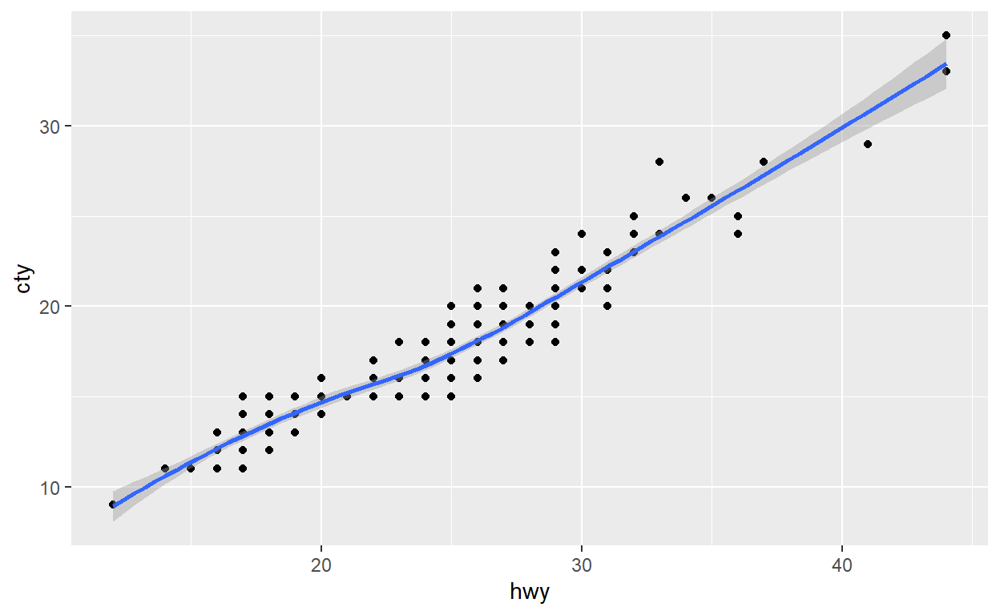

```{r setup, include=FALSE}
library(learnr)
knitr::opts_chunk$set(echo = FALSE)
library(tidyverse)
```


## Easy

### Exercise 1

Quiz

```{r quiz}
quiz(
  question("Which of the following are considered variables in facet_wrap ?",
    answer("rows"),
    answer("cols"),
    answer("nrow", correct= TRUE),
    answer("ncol", correct= TRUE)
  )
)
```

### Exercise 2  

Quiz  

```{r quiz2}
quiz(
  question("Which of the following are considered variables in facet_grid ?",
    answer("rows", correct= TRUE),
    answer("cols", correct= TRUE),
    answer("nrow"),
    answer("ncol")
  )
)
```

##  Intermediate Level

### Exercise 3

Recreate the R code necessary to generate the following graphs

<!--  -->

```{r 3, exercise=TRUE, include=FALSE, exercise.lines=5}
ggplot(data=mpg, mapping = aes(x=, y=)) +
  geom_point() +
  geom_line() +
```

### Exercise 4

When we run the following code, we get this error message: "Continuous value supplied to discrete scale" How can this which variable should be changed ?
```{r 4, exercise=TRUE, exercise.lines=5}
ggplot() +
  geom_point(data=mpg, mapping= aes(x=displ, y= hwy, color= drv)) +
  geom_line(data=mpg, mapping = aes(x=displ, y= hwy, color= cyl))

```


## Advanced

### Exercise 5

Write the R code for geom_point, and geom_smooth, with color=class, excluding all 2seater cars
```{r 5, exercise=TRUE, exercise.eval=TRUE}
ggplot(data = mpg, mapping = aes(x = displ, y = hwy)) + 
   geom_point(data = filter(mpg, class != "2seater"), mapping = aes(color = class)) + 
   geom_smooth(data = filter(mpg, class != "2seater"), se= FALSE)
```
